# Trabalho final (Grupo 1)

## Membros do Trabalho

- Arthur Carneiro da Rocha Menezes UC19100325
- Felipe Souza Marra UC20101381
- Gabriel Silva Carneiro UC19200914
- Bruna Rosa Rodrigues UC19104410
- Matheus Cordeiro dos Santos UC19102628
- Melquisedeque Magalhães Sodré UC19201469

---

## Sumário

- [Introdução](#introdução)

- [Objetivo](#objetivo)

  - [Objetivo Geral](#objetivo-geral)

  - [Objetivo Específico](#objetivo-específico)

- [Desenvolvimento](#desenvolvimento)

  - [Análise de Negócio](#análise-de-negócio)
  
  - [Sistema Atual](#sistema-atual)

      - [Power BI Atual](#power-bi-atual)

      - [Fluxograma de Negócios](#fluxograma-de-negócios)

  - [Proposta de Melhoria](#proposta-de-melhoria)
      
      - [Power BI Melhoria](#power-bi-melhoria)
        
      - [Fluxograma de Melhoria](#fluxograma-de-melhoria)
      
  - [CMMI](#cmmi)

- [Conclusão](#conclusão)

  - [Sprints](#sprints)

---

## Introdução
Este um projeto para trazer a melhoria de fluxos, buscando melhorar o processo, comunicação e toda a qualidade do projeto.

---

## Objetivo

Aqui serão mostrados os objetivo geral e específicos para entender melhor o desenrolar dos tópicos a seguir.

### Objetivo Geral

O trabalho visa a melhoria nos processo de comunicação entre o desenvolvedor e o cliente, ou seja, será intermediado um processo de melhoramento da situação atual de como se encontra o utilizado pelo Desenvolvedor Solo(Freelancer) com o Cliente.

### Objetivo Específico

Desenvolver um fluxo, com todos os softwares e características, além de customizar o Software _`Sales Force`_ para a comunicação entre o deselvolvedor e os clientes.

---

## Desenvolvimento

O sistema consiste em um sistema de comunicação entre cliente e desenvolvedor, sem nenhum fluxo e processo pré-estabelecido. 
Iniciamos um processo de melhoria, criando fluxos e processos, levando em consideração a documentação CMMI, seguindo do nível um para o nível dois com as melhorias agora definidas.

### Análise de Negócio

O negócio consiste em desenvolvimento de software por encomenda, que vá trazer qualidade e resultado para o cliente. Possuindo duas opções mensal ou por desenvolvimento de produto solicitado por cliente:
- **Mensal:** consiste em o cliente pagar mensalidades para que possa usar o software;
- **Solicitado:** consiste em o cliente soliticar o software para ser associado ao seu nome em troca de um valor combinado ou proposto. 

### Sistema Atual

O sistema atual se trata de um sistema de desenvolvimento de software, que têm como objetivo trazer melhoria á comunicação entre cliente e o desenvolvedor e todo levantamento inicial para o desenvolvimento dos softwares.
A comunicação é manual, como envios e-mail, sem um fluxo de comunicação pré-definido.

#### Power BI 
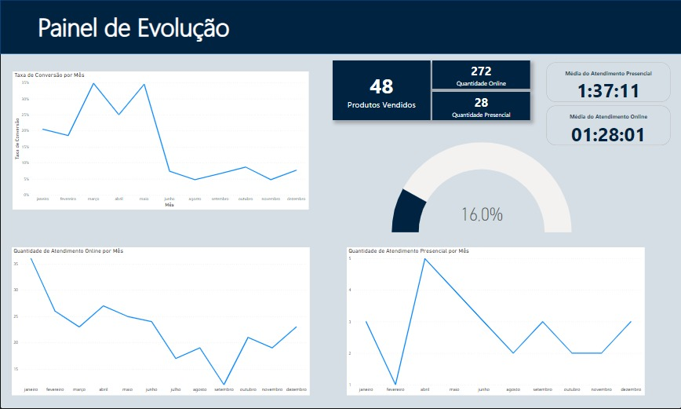

#### Fluxograma de Negócios

Neste tópicos seram descritos todos os fluxos atuais utilizado para comunicação entre Cliente e Desenvolvedor.

Nesta imagem é mostrado como um Cliente que está utilizando o produto, definindo tópicos da conversa com o Desenvolvedor.
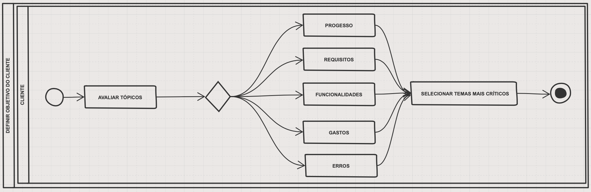

Nesta imagem é mostrado uma comunicação online do Cliente com o Desenvolvedor.
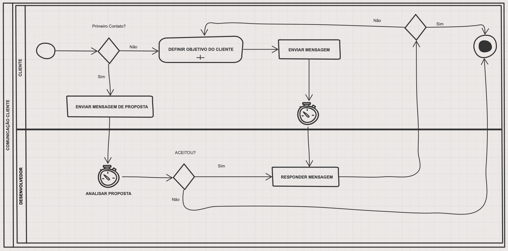

Nesta imagem é mostrado uma comunicação online do Cliente para gerar uma reunião presencial com o Desenvolvedor.
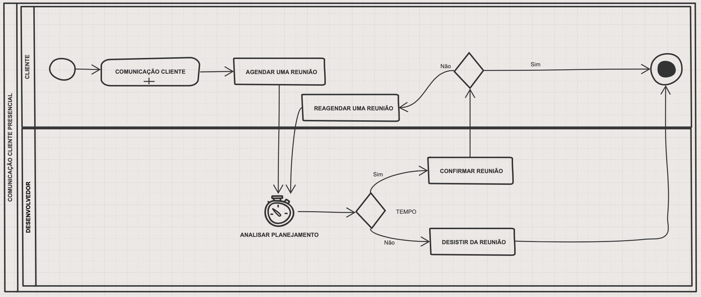

Nesta imagem é mostrado como um Desenvolvedor que desenvolve o produto, definindo tópicos da conversa com o Cliente(s).
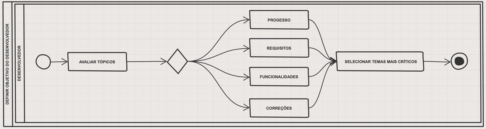

Nesta imagem é mostrado uma comunicação online do Desenvolvedor com o Cliente.
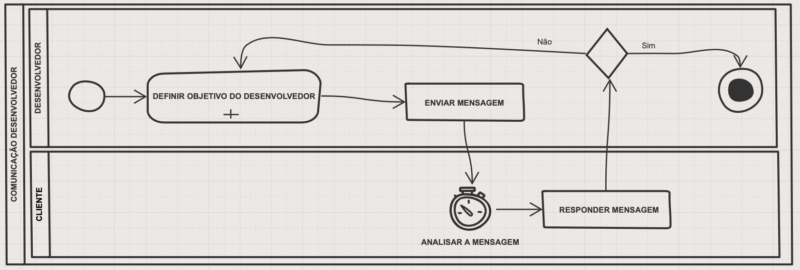

Nesta imagem é mostrado uma comunicação online do Desenvolvedor para gerar uma reunião presencial com o Cliente.
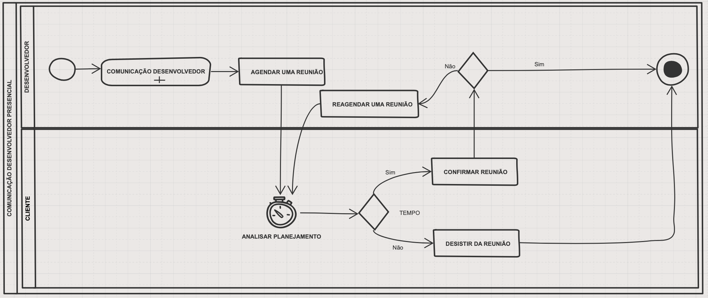

### Proposta de Melhoria

O sistema melhorado é um sistema totalmente automatizado para comunicação do desenvolvedor e do cliente, criando um fluxo bem estruturado e de fácil entendimento.

#### Fluxograma de Melhoria
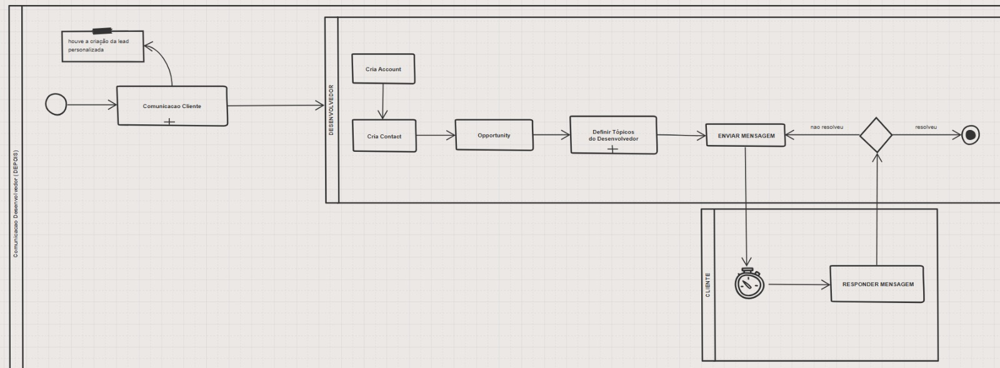
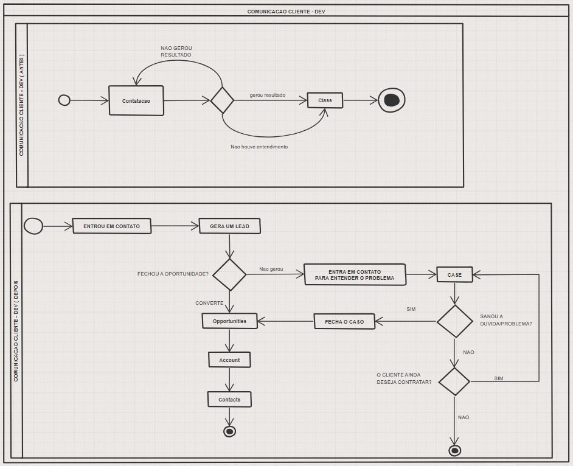

### CMMI

Como dito que o sistema atual está no nível 1 no CMMI temos características como:
- imprevisível.
- reativa.
- processos não definidos.

Supostamente quando houver a melhoria criada ela avançará para o nível 2, com as características:
- Quantativo;
- Gerenciado.
- Planejamento
- Realização.
- Medição.
- Controle dos projetos.

---

## Conclusão

Em conclusão, o trabalho visa melhorar a comunicação entre desenvolvedores freelancers e clientes, aprimorando os processos existentes. Isso resultará em colaboração mais eficiente, compreensão clara das necessidades do cliente, comunicação fluida e entrega de projetos satisfatórios. A melhoria na comunicação promoverá relacionamentos sólidos e bem-sucedidos, impulsionando a qualidade e a eficiência do trabalho.

### Sprints

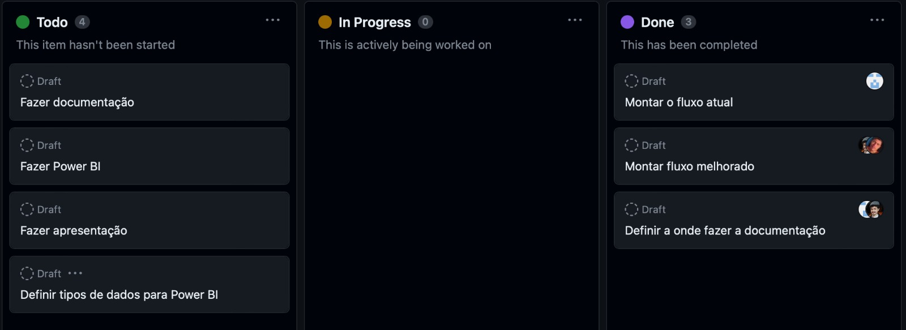
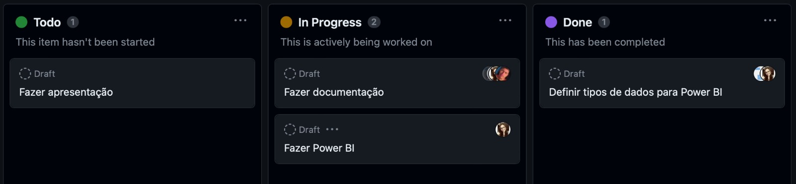
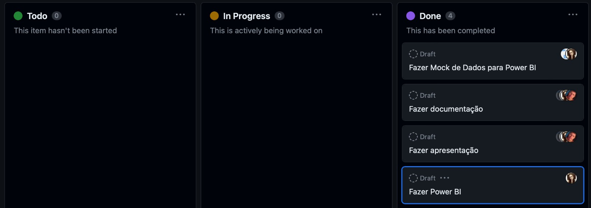
